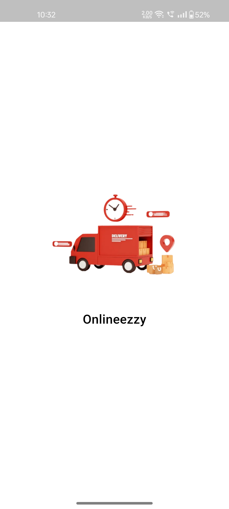
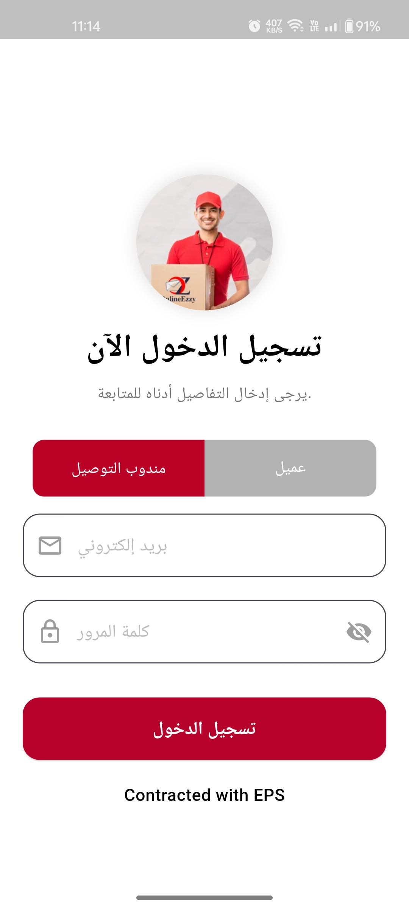
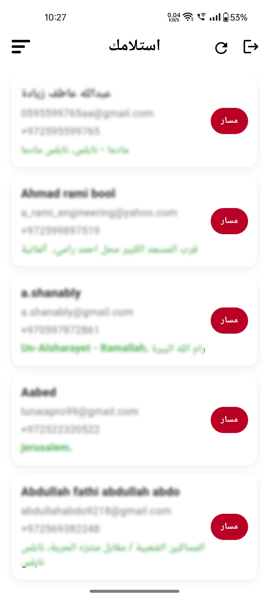
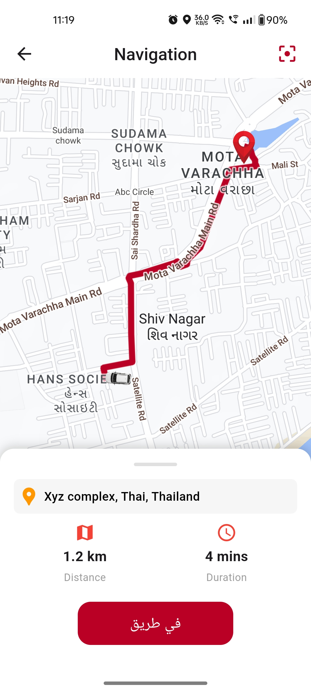

# Onlineezzy: Courier Delivery App
   
Platform : Flutter 
State Management : GetX 
In App Language Support : Arabic and English 
Map Library : google_maps_flutter   

 
Android App : https://play.google.com/store/apps/details?id=com.onlineezzy.app
 
Ios App : https://apps.apple.com/us/app/onlineezzy/id6739391493
 
Web Site : https://onlineezzy.com/
 
 
 
This application is developed for delivery business, user can check courier delivery status with real time location updates about them. 
This app have two login role first is for User and second is for Delivery boy.

 
 
 
 

  
  
  
  

